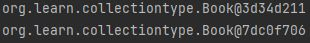

# i、IOC

## 一、基本概念

> 1. **控制反转**（Inversion of Control，缩写为**IoC**），面向对象编程的一种设计原则，可以用来减低计算机代码之间的耦合度。最常见的方式叫做依赖注入（Dependency Injection，简称**DI**），还有一种方式叫依赖查找（Dependency Lookup）。
> 2. 通过控制反转，对象在被创建的时候，由一个调控系统内所有对象的外界实体将其所依赖的对象的引用传递给它。也可以说，依赖被注入到对象中。
> 3. IOC思想基于IOC容器完成，IOC容器底层就是对象工厂

### 1.Spring提供IOC容器实现两种方式

##### 1.BeanFactory：IOC容器基本实现，是spring内部的使用接口，不提供开发人员进行使用（*加载配置文件的时候不会创建对象，在获取对象才去创建对象）

##### 2.ApplicationContext：BeanFactory接口的子接口，提供更多更强大的功能，一般由开发人员进行使用（*加载配置文件的时候就会把在配置文件对象进行创建）

### 2.ApplicaitonContext接口实现类

#### 1.FileSystemXmlApplicationContext

#### 2.ClassPathXmlApplicationContex

```java
ApplicationContext context = new ClassPathXmlApplicationContext("配置bean文件名称.xml");
```

## 二、IOC操作bean管理：XML方式

### 一、基于xml方式进行属性注入

#### 1. 第一种使用property完成属性注入（name：类里面属性名称，value：向属性里面注入的值）

```xml
<bean id="book" class="org.learn.demon01.Book">
    <property name="bauthor" value="author"></property>
    <property name="bname" value="name"></property>
</bean>
```

#### 2. 第二种注入方式，使用有参数构造进行注入

##### 1.创建类，定义属性，创建属性对应有参数的构造方法

```java
//属性
private String oname;
private String address;
//构造方法
public Orders(String oname, String address) {
    this.oname = oname;
    this.address = address;
}
```

##### 2.在spring配置文件中进行配置

```xml
<bean id="orders" class="org.learn.demon01.Orders">
    <constructor-arg name="oname" value="name"></constructor-arg>
    <constructor-arg name="address" value="address"></constructor-arg>    
</bean>
```

> 构造器中也可以使用Index替换name,值0代表第一个参数，1代表第二个参数。。。。

#### 3. 第三种p名称空间注入

##### 1.第一步添加p名称空间在配置文件头部xml标签中

```xml
<beans xmlns="http://www.springframework.org/schema/beans"
       xmlns:xsi="http://www.w3.org/2001/XMLSchema-instance"
       xmlns:p="http://www.springframework.org/schema/p" <!--添加这个语句-->
       xsi:schemaLocation="http://www.springframework.org/schema/beans http://www.springframework.org/schema/beans/spring-beans.xsd">
```

##### 2.第二步进行属性注入，在bean标签里面进行操作

```xml
 <bean id="book" class="org.learn.demon01.Book" p:bauthor="author" p:bname="name"></bean>
```

#### 3.xml注入其他类型属性

##### 1.字面量

1. null值

   ```xml
   <property name="填写属性名">
       <null></null>
   </property>
   ```

2. 属性值包含特殊符号

   1. 把符号进行转义  &lt    &gt

   2. 把特殊符号内容写到CDATA

      ```xml
      <value><![CDATA[带有特殊符号的内容]]></value>
      ```

##### 2.注入属性-外部bean

1. 创建两个类service类和dao类

2. 在service调用dao里面的方法

   ```java
   public class UserService {
       private UserDao userDao;
       public void setUserDao(UserDao userDao) {
           this.userDao = userDao;
       }
       public void add(){
           System.out.println("service add ...........");
           userDao.update();
       }
   }
   ```

3. 在spring配置文件中进行配置

   ```xml
   <!--创建service和dao对象-->
   <bean id="userService" class="org.learn.demon01.service.UserService">
       <!--注入userdao对象-->
       <property name="userDao" ref="userDaoImpl"></property>
   </bean>
   <bean id="userDaoImpl" class="org.learn.demon01.dao.UserDaoimpl"></bean>
   ```

##### 3.注入属性-内部bean

1. 一对多关系：部门和员工

   > 一个部门有多个员工，一个员工属于一个部门，部门是一，员工是多

2. 在实体类之间表示一对多关系，员工表示所属部门，使用对象类型属性进行表示

   ```java
   public class Emp {
       private String ename;
       private String gender;
       private Dept dept;
       public void setDept(Dept dept) {
           this.dept = dept;
       }
       public void setGender(String gender) {
           this.gender = gender;
       }
       public void setEname(String ename) {
           this.ename = ename;
       }
   }
   ```

3. 在spirng配置文件中进行配置

   ```xml
   <bean id="emp" class="org.learn.demon01.bean.Emp">
           <property name="ename" value="empname"></property>
           <property name="gender" value="nan"></property>
           <property name="dept">
               <!--内部bean创建对象-->
               <bean id="dept" class="org.learn.demon01.bean.Dept">
                   <property name="dname" value="deptname"></property>
               </bean>
           </property>
   </bean>
   ```

##### 4.注入属性-级联赋值

> - 外部bean写法，在外部bean里赋值
>
> - 外部bean创建对象，内部属性赋值
>
>   ```xml
>   <bean id="emp" class="org.learn.demon01.bean.Emp">
>           <property name="ename" value="empname"></property>
>           <property name="gender" value="nan"></property>
>           <property name="dept" ref="dept"></property>
>       	<!--获取对象属性值需要设置get方法-->
>           <property name="dept.dname" value="dept"></property>
>   </bean>
>   <bean id="dept" class="org.learn.demon01.bean.Dept"></bean>
>   ```

#### 4.xml注入集合属性

> 1. 注入数组类型属性
> 2. 注入List集合类型属性
> 3. 注入Map集合类型属性

1. 创建类，传入数组，集合对象

   ```java
   public class Stu {
       private String[] courses;
       private List<String> list;
       private Map<String,String> maps;
       private Set<String> sets;
       public void setSets(Set<String> sets) {
           this.sets = sets;
       }
       public void setList(List<String> list) {
           this.list = list;
       }
       public void setMaps(Map<String, String> maps) {
           this.maps = maps;
       }
       public void setCourses(String[] courses) {
           this.courses = courses;
       }
   }
   ```

2. 在spring配置文件中进行配置

   ```xml
   <bean id="stu" class="org.learn.collectiontype.Stu">
           <property name="courses">
               <!--数组形式注入-->
               <array>
                   <value>JAVA课程</value>
                   <value>数据库课程</value>
               </array>
           </property>
           <property name="list">
               <!--列表形式注入-->
               <list>
                   <value>张三</value>
                   <value>李四</value>
               </list>
           </property>
           <property name="maps">
               <!--map形式注入-->
               <map>
                   <entry key="JAVA" value="java"></entry>
                   <entry key="PHP" value="php"></entry>
               </map>
           </property>
           <property name="sets">
               <!--集合形式注入-->
               <set>
                   <value>MySql</value>
                   <value>Redis</value>
               </set>
           </property>
   </bean>
   ```

#### 5.在集合里面设置对象类型值

1. 设置类

   ```java
   private List<Course> courseList;
   public void setCourseList(List<Course> courseList) {
           this.courseList = courseList;
   }
   ```

2. 在spring中配置对象集合

   ```xml
   <bean id="stu" class="org.learn.collectiontype.Stu">
           <property name="courseList">
                       <!--注入List对象-->
                       <list>
                           <ref bean="couse1"></ref>
                           <ref bean="couse2"></ref>
                       </list>
           </property>
   </bean>
   <bean id="couse1" class="org.learn.collectiontype.Course">
           <property name="cname" value="spring框架5"></property>
   </bean>
   <bean id="couse2" class="org.learn.collectiontype.Course">
           <property name="cname" value="框架"></property>
   </bean>
   ```

#### 6.集合注入部分提取

##### 1.在spring配置文件中引入名称空间util(IDEA写util标签可以自动引入头部配置)

```xml
<beans xmlns="http://www.springframework.org/schema/beans"
       xmlns:xsi="http://www.w3.org/2001/XMLSchema-instance" 								             	xmlns:util="http://www.springframework.org/schema/util"
       xsi:schemaLocation="http://www.springframework.org/schema/beans 			http://www.springframework.org/schema/beans/spring-beans.xsd http://www.springframework.org/schema/util https://www.springframework.org/schema/util/spring-util.xsd">
```

##### 2.使用util标签完成list集合注入提取

```xml
<!--提取list集合类型属性注入-->
<util:list id="bookList">
    <value>JAVA</value>
    <value>C</value>
    <value>JS</value>
</util:list>
<!--提取list集合类型属性使用-->
<bean id="book" class="org.learn.collectiontype.Book">
    <property name="list" ref="bookList"></property>
</bean>
```

### 二、Bean

#### 1.类型分类及介绍

> Spring有两种bean，一种普通bean,另外一种工厂bean(FactoryBean)

##### 1.普通bean

> 在spring配置文件中，bean定义什么类型就返回什么类型

##### 2.工厂bean

> 在配置文件定义bean类型可以和返回类型不一样

第一步：创建类，让这个类作为工厂bean，实现接口FactoryBean

第二步：实现接口里面的方法，在实现的方法中定义返回的bean类型

```java
public class MyBean implements FactoryBean<Course>{
    //定义返回bean
    @Override
    public Course getObject() throws Exception {
        Course course = new Course();
        course.setCname("abc");
        return course;
    }
    @Override
    public Class<?> getObjectType() {
        return null;
    }
    @Override
    public boolean isSingleton() {
        return FactoryBean.super.isSingleton();
    }
}
```

#### 2.bean的作用域

##### 1.在spring里面，默认情况下，bean是单实例对象

> 验证方法：把一个对象获取多次，然后输出，输出之后比较地址，观察地址是否相同

```java
@Test
public void testT2(){
    ApplicationContext context = new ClassPathXmlApplicationContext("bean2.xml");
    Book book1 = context.getBean("book", Book.class);
    Book book2 = context.getBean("book", Book.class);
    System.out.println(book1);
    System.out.println(book2);
}
```


##### 2.设置bean为单实例或多实例

1. 在spring配置文件里面有一个属性（scope）用于设置单实例还是多实例

2. scope属性值：

    1. 第一个值：默认值singleton，表示是单实例对象

    2. 第二个值：prototype，表示是多实例对象

       ```xml
       <bean id="book" class="org.learn.collectiontype.Book" scope="prototype">
               <property name="list" ref="bookList"></property>
       </bean>
       ```

       

3. singleton和prototype区别

   > 第一：singleton单实例，prototype多实例
   >
   > 第二：设置scope值是singleton时候，加载spring配置文件时候就会创建单实例对象
   >
   > ​			设置scope值是prototype时候，不是在加载spring配置文件时候创建对象，在调用getBean方法时候创建多实例对象

4. scope还有两个属性是request和session，表示向浏览器发送一次请求或者一次会话

#### 3.bean的生命周期

> 生命周期：从对象创建到对象销毁的过程

1. 通过构造器创建bean实例（无参数构造）
2. 为bean的属性设置值和对其他bean的引用（调用set方法）
3. **把bean实例传递bean后置处理器的方法**（配置后置处理器生效）
4. 调用bean的初始化的方法
5. **把bean实例传递bean后置处理器的方法**（配置后置处理器生效）
6. bean可以使用（成功获取对象）
7. 当容器关闭的时候，调用bean的销毁的方法（配置销毁的方法）

> bean生命周期5步示例代码（配置后置处理器为7步）

主类：

```java
public class Orders {
    private String oname;
    public Orders() {
        System.out.println("第1步构造器创建bean实例");
    }
    public void setOname(String oname) {
        this.oname = oname;
        System.out.println("第2步调用set方法");
    }
    public void initMethod(){
        System.out.println("第3步调用bean初始化方法");
    }
    public void destoryMethod(){
        System.out.println("第5步调用bean销毁方法");
    }
}
```

后置处理器继承类（可不配置）：

```java
public class MyBeanPost implements BeanPostProcessor {
    @Override
    public Object postProcessBeforeInitialization(Object bean, String beanName) throws BeansException {
        System.out.println("初始化之前运行的方法");
        return BeanPostProcessor.super.postProcessBeforeInitialization(bean, beanName);
    }
    @Override
    public Object postProcessAfterInitialization(Object bean, String beanName) throws BeansException {
        System.out.println("初始化之后运行的方法");
        return BeanPostProcessor.super.postProcessAfterInitialization(bean, beanName);
    }
}
```

测试类：

```java
@Test
public void test4(){
    //ClassPathXmlApplicationContext有close方法，applicationContext里没有销毁方法
    ClassPathXmlApplicationContext context = new ClassPathXmlApplicationContext("bean4.xml");
    Orders orders = context.getBean("orders", Orders.class);
    System.out.println("第4步获取bean对象"+orders);
    //第5步手动配置bean销毁
    context.close();
}
```

spring配置文件：

```xml
<!--手动配置初始化和销毁bean方法-->
<bean id="orders" class="org.learn.collectiontype.bean.Orders" init-method="initMethod" destroy-method="destoryMethod">
    <property name="oname" value="JAVA"></property>
</bean>
<!--后置处理器配置，配置之后任何bean实例都会自动调用（可不配置）-->
<bean id="myBeanPost" class="org.learn.collectiontype.bean.MyBeanPost"></bean>
```

> 五步运行结果截图示例：


> 配置后置处理器，七步运行结果截图示例：


### 三、xml自动装配

#### 1.什么是自动装配

> 根据指定装配规则（属性名称或者属性类型），spring自动将匹配的属性值进行注入

#### 2.自动装配过程

##### 1.bean标签属性autowire，配置自动装配

##### 2.autowire属性两个常用值

 1. byName:根据属性名称注入，注入值bean的id值和类属性名称一样

 2. byType:根据属性类型注入(**用bean创建多个相同类型的对象时该属性会报错**)

    ```xml
    <bean id="emp" class="org.learn.collectiontype.autowire.Emp" autowire="byName"></bean>
    <bean id="dept" class="org.learn.collectiontype.autowire.Dept"></bean>
    ```

### 四、外部属性文件

#### 1.直接配置数据库信息

##### 1.引入druid连接池依赖

```xml
<dependency>
            <groupId>com.alibaba</groupId>
            <artifactId>druid</artifactId>
            <version>1.1.9</version>
</dependency>
<dependency>
            <groupId>mysql</groupId>
            <artifactId>mysql-connector-java</artifactId>
            <version>8.0.24</version>
</dependency>
```

##### 2.配置druid连接池

```xml
<bean id="dataSource" class="com.alibaba.druid.pool.DruidDataSource">
        <property name="driverClassName" value="com.mysql.cj.jdbc.Driver"></property>
        <property name="url" value="jdbc:mysql://localhost:3306/userDb"></property>
        <property name="username" value="root"></property>
        <property name="password" value="Tmh010625"></property>
</bean>
```

#### 2.引入外部属性文件配置数据库连接池

##### 1.创建外部属性文件，properties格式文件，写数据库信息

```properties
prop.driverClass=com.mysql.cj.jdbc.Driver
prop.url=jdbc:mysql://localhost:3306/userDb
prop.userName=root
prop.password=Tmh010625
```

##### 2.把外部properties属性文件引入到spring配置文件中（使用context需要配置xml头文件）

```xml
<!--使用IDEA写context：属性即可直接导入-->
<!--xml头文件配置-->
<beans xmlns="http://www.springframework.org/schema/beans"
       xmlns:xsi="http://www.w3.org/2001/XMLSchema-instance"
       xmlns:context="http://www.springframework.org/schema/context"
       xsi:schemaLocation="http://www.springframework.org/schema/beans
                           http://www.springframework.org/schema/beans/spring-beans.xsd
                           http://www.springframework.org/schema/context
                           http://www.springframework.org/schema/context/spring-context.xsd">
```

```xml
<!--具体配置-->
<context:property-placeholder location="classpath:jdbc.properties"/>
<bean id="dataSource" class="com.alibaba.druid.pool.DruidDataSource">
    <property name="driverClassName" value="${prop.driverClass}"></property>
    <property name="url" value="${prop.url}"></property>
    <property name="username" value="${prop.userName}"></property>
    <property name="password" value="${prop.password}"></property>
</bean>
```

## 三、IOC操作bean管理：注解方式

### 一、注解概念

1. 注解是代码特殊标记。格式：@注解名称（属性名称=属性值，属性名称=属性值......）
2. 使用注解，注解可以作用在类上面，方法上面，属性上面
3. 使用注解目的：简化xml配置，把配置用更优雅更简洁的方式实现

### 二、spring针对bean管理创建对象提供的注解

> 1. @Component
> 2. @Service
> 3. @Controller
> 4. @Repository
>
> 上面四个注解功能是一样的，都可以用来创建bean实例

### 三、基于注解方式实现对象创建

#### 1.引入依赖(或者导入aop的jar包)

```xml
<dependency>
            <groupId>org.springframework</groupId>
            <artifactId>spring-aop</artifactId>
            <version>5.3.8</version>
</dependency>
```

#### 2.开启组件扫描

##### 1.引入context标签

> 见一、->五、->2.->2.具体context配置

##### 2.扫描多个包

###### 1.多个包使用逗号隔开

```xml
<context:component-scan base-package="org.learn.demon.dao,org.learn.demon.service"></context:component-scan>
```

###### 2.直接扫描上层目录

```xml
<context:component-scan base-package="org.learn"></context:component-scan>
```

#### 3.创建类，在类上面添加创建对象注解

```java
@Component(value = "userService")
public class UserService {
    public void add(){
        System.out.println("service add.....");
    }
}
```

> 1. vlaue的值和id的值是等价的<bean id="" class=""/>
> 2. 在注解里value属性值可以省略不写，默认是类名称，首字母小写

#### 4.开启组件扫描里的细节配置

##### 1.include-filter

```xml
<context:component-scan base-package="org.learn" use-default-filters="false">
        <context:include-filter type="annotation" expression="org.springframework.stereotype.Component"/>
</context:component-scan>
```

> use-default-filters="false"：不使用系统默认的filter扫描组件
>
> context:include-filter：包含后面expression表达式内容的组件会被扫描

##### 2.exclude-filter

```xml
<context:component-scan base-package="org.learn">
        <context:exclude-filter type="annotation" expression="org.springframework.stereotype.Component"/>
</context:component-scan>
```

> context:exclude-filter：包含后面expression表达式内容的组件不会被扫描

### 四、基于注解方式实现属性注入

#### 1.@Autowired

> 根据属性类型进行自动装配

##### 1.第一步

把service和dao对象创建，在service和dao类添加创建对象注解

```java
@Repository
public class UserDaoImpl1 implements UserDao{
    @Override
    public void add() {
        System.out.println("dao add......");
    }
}
```

##### 2.第二步

在service注入dao对象，在service类添加dao类型属性，在属性上面使用注解

```java
@Service
public class UserService {
    @Autowired
    private UserDao userDao;
    public void add(){
        userDao.add();
        System.out.println("service add.....");
    }
}
```

> 定义dao类型属性，不需要添加set方法

#### 2.@Qualifier

> 根据属性名称进行注入（和@Autowired注解一起使用）

```java
@Autowired
@Qualifier(value = "userDaoImpl1")
private UserDao userDao;
```

> 当一个接口有多个实现类时，@Autowired就无法知道是哪个实现类，需要@Qualifier根据名称来具体定位

#### 3.@Resource

> 可以根据类型注入，也可以根据名称注入

```java
//@Resource//根据类型进行注入
@Resource(name = "userDaoImpl1")//根据名称进行注入
private UserDao userDao;
```

> @Resource是javax提供的，并不是由spring提供的，因此更建议用@Autowired和@Qualifier

#### 4.@Value

> 注入普通类型属性

```java
@Value(value = "abc")
private String name;
```

### 五、完全注解开发

> 这一部分一般使用springboot开发

#### 1.创建配置类，替代xml配置文件

```java
@Configuration
@ComponentScan(basePackages = {"org.learn"})
public class SpringConfig{
}
```

##### 1.@Configuration

> 作为配置类，替代xml配置文件

##### 2.@ComponentScan(basePackages = {"扫描包路径"})

> 替代xml配置文件中context:component-scan

#### 2.编写测试类

```java
@Test
public void test2(){
    ApplicationContext context = new AnnotationConfigApplicationContext(SpringConfig.class);
    UserService userService = context.getBean("userService", UserService.class);
    System.out.println(userService);
    userService.add();
}
```

> 实例化bean对象时使用AnnotationConfigApplicationContext替代以前xml文件接口实现

# ii、AOP

## 一、基本概念

> 1. AOP为Aspect Oriented Programming的缩写，意为：面向切面编程，通过预编译方式和运行期间动态代理实现程序功能的统一维护的一种技术。
> 2. 利用AOP可以对业务逻辑的各个部分进行隔离，从而使得业务逻辑各部分之间的耦合度降低，提高程序的可重用性，同时提高了开发的效率。
> 3. 通俗描述：不通过修改源代码方式，在主干功能里添加新功能

### 一、使用登录流程展示AOP概念


## 二、AOP底层原理

### 一、AOP底层使用动态代理

#### 1.动态代理两种情况

##### 1.有接口情况：使用JDK动态代理

> 创建接口实现类代理对象，增强类的方法


##### 2.无接口情况：使用CGLIB动态代理

> 创建子类的代理对象，增强类的方法


### 二、 JDK动态代理实现

#### 1.调用newProxyInstance方法

```java
static Object newProxyInstance(ClassLoader loader,Class<?>[] interface,InvocationHandler h);
```

> 1. 方法所在位置java.lang.reflect.Proxy
> 2. 第一个参数，类加载器
> 3. 第二个参数，增强方法所在的类，这个类实现的接口，支持多个接口
> 4. 第三个参数，实现这个接口InvocationHandler，创建代理对象，写增强的方法

#### 2.动态代码实例展示

+ 主类

```java
public class JDKProxy {
    public static void main(String[] args) {
        UserDaoImpl dao = new UserDaoImpl();
        Class[] interfaces = {UserDao.class};
        UserDao res = (UserDao) Proxy.newProxyInstance(JDKProxy.class.getClassLoader(), interfaces, new UserDaoProxy(dao));
        int add = res.add(1, 2);
        String s = res.update("名字");
        System.out.println(add);
        System.out.println(s);
    }
}
class UserDaoProxy implements InvocationHandler{
    private Object obj;
    public UserDaoProxy(Object obj){
        this.obj = obj;
    }
    @Override
    public Object invoke(Object proxy, Method method, Object[] args) throws Throwable {
        System.out.println("方法之前执行：："+method.getName()+"传递的参数"+ Arrays.toString(args));
        Object res = method.invoke(obj, args);
        System.out.println("方法之后执行：："+obj);
        return res;
    }
}
```

+ 被代理类

```java
public class UserDaoImpl implements UserDao{
    @Override
    public int add(int a, int b) {
        System.out.println("add方法执行了");
        return a+b;
    }
    @Override
    public String update(String id) {
        System.out.println("update方法执行了");
        return id;
    }
}
```

## 三、AOP操作

### 一、AOP术语

#### 1.连接点

> 类里面可以增强的方法，这些方法称为连接点

#### 2.切入点

> 实际被真正增强的方法，称为切入点

#### 3.通知（增强）

##### 1.实际增强的逻辑部分称为通知（增强）

##### 2.通知类型分类

> 1. 前置通知
> 2. 后置通知
> 3. 环绕通知
> 4. 异常通知
> 5. 最终通知

#### 4.切面（动作）

> 把通知应用到切入点过程

### 二、准备工作

#### 1.Spring框架一般都是基于AspectJ实现AOP操作

##### 1.什么是AspectJ

> AspectJ不是Spring组成部分，独立AOP框架，一般把AspectJ和Spring框架一起使用，进行AOP操作

#### 2.基于AspectJ实现AOP操作

##### 1.基于xml配置文件实现

##### 2.基于注解方式实现（使用）

#### 3.在项目工程引入AOP相关依赖

```xml
<dependency>
    <groupId>cglib</groupId>
    <artifactId>cglib</artifactId>
    <version>3.0</version>
</dependency>
<dependency>
    <groupId>aopalliance</groupId>
    <artifactId>aopalliance</artifactId>
    <version>1.0</version>
</dependency>
<dependency>
    <groupId>org.aspectj</groupId>
    <artifactId>aspectjweaver</artifactId>
    <version>1.9.6</version>
</dependency>
```

#### 4.切入点表达式

##### 1.切入点表达式作用

> 知道对哪个类里面的哪个方法进行增强

##### 2.语法结构

> execution(\[权限修饰符]\[返回类型]\[类全路径]\[方法名称]([参数列表]))

